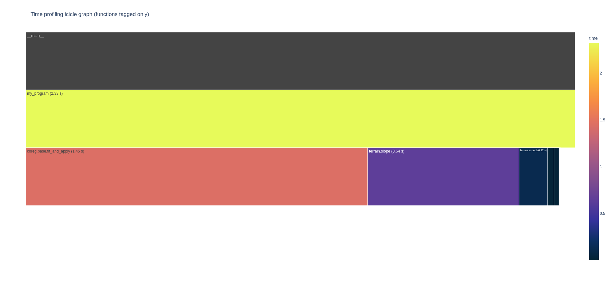
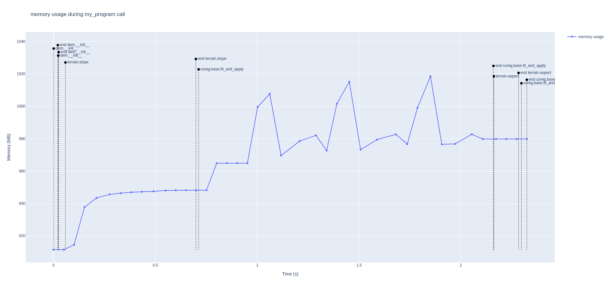

# Profiling

xDEM has a built-in profiling tool, that can be used to provide more insight on the memory and time use of function.
```{warning}
Make sure to install xDEM with development dependencies included.
```

By default, two kinds of .HTML graphs will be created:
* an icicle graph `time_graph.html`, showing the time spent in each step of the entire process
* a graph `memory_[function].html` for each decorated functions used , showing the memory consumption of xDEM at regular intervals during the execution


## Configuration and parameters

xDEM's profiling configuration works just like a pipeline step. It need to be initialised with two parameters like this:

| Name              | Description                       | Type | Default value | Required |
|-------------------|-----------------------------------| ------- | ------- | ------- |
| **save_graphs**   | Save the default graphs generated | bool | False | No |
| **save_raw_data** | Save the raw data on calls as a .pickle file | bool | False | No |

Example of initialization:

```{code-cell} ipython3
from xdem.profiler import Profiler

Profiler.enable(save_graphs=True, save_raw_data=True)
```

After this, if `save_graphs` or `save_raw_data` are True, every profiled function will be studied by the profiler.

## Saved profiling data

When *save_raw_data* is enabled, xDEM saves the profiling information as a .pickle file containing a pandas DataFrame with the following structure:

| Name              | Description                                                                                                                                       |
|-------------------|---------------------------------------------------------------------------------------------------------------------------------------------------|
| **level**         | Depth of the function call in the profiling stack                                                                                                 |
| **uuid_parent**   | UUID of the "parent" call (call that was running when this call was made)                                                                         |
| **name**          | Understandable name given to the function call                                                                                                    |
| **uuid_function** | Unique identifier of the function call                                                                                                            |
| **time**          | Time (in seconds) it took to execute the function                                                                                                 |
| **call_time**     | Timestamp (in seconds) at which the call was made                                                                                                 |
| **memory**        | Either None or a list of (timestamp memory) tuples representing memory consumption (in megabytes) at each timestamp during the function execution |


## The profiled functions


Currently, some processes are already profiled by xDEM:
- all the terrain attributes computation `terrain.attr`
- all the co-registration processing through the fit_and_apply function.

### Modifying the profiled functions


But include to profile other functions and add them to the summary graphs and data, simply add the *@profile* decorator before them, providing a descriptive name.

If you also want to track memory usage over time for a specific function call, set `memprof=True` in the decorator.
If the function is too fast (or slow) for the default memory sampling interval, you can modify it with *interval* (in seconds).

```{code-cell} ipython3
from xdem.profiler import Profiler

@profile("my profiled function", memprof=True, interval=0.5)  # type: ignore
def my_function():
    ...
```
### Output graphs example

Here is two example of graphs with a personal profiled function `my_program`, containing few attributes and co-registration computation:



