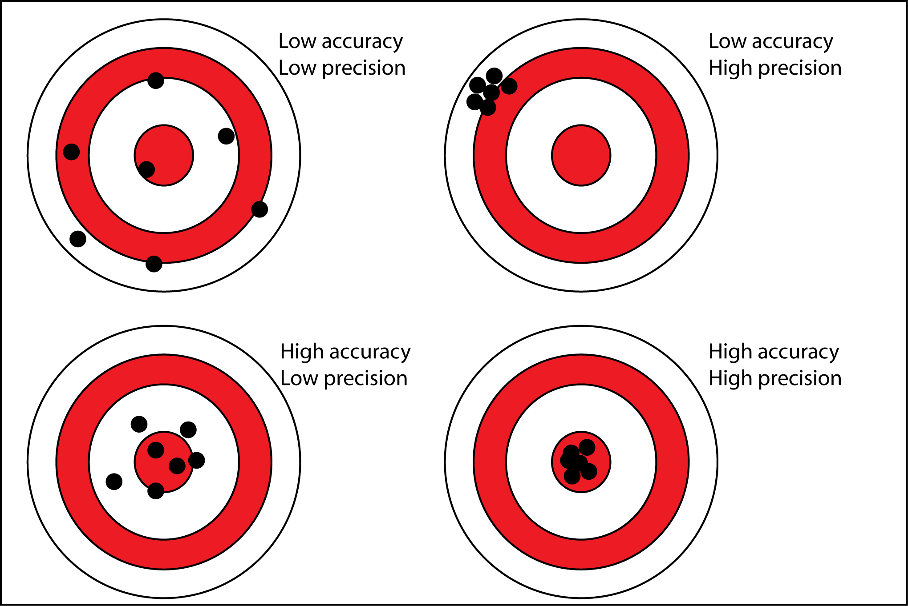

.. _intro:

Analysis of accuracy and precision
==================================

Digital Elevation Models are numerical, gridded representations of elevation. They are generated from different
instruments (e.g., optical sensors, radar, lidar), acquired in different conditions (e.g., ground, airborne, satellite)
, and using different post-processing techniques (e.g., photogrammetry, interferometry).

While some complexities are specific to certain instruments and methods, all DEMs generally possess:

- a `ground sampling distance <https://en.wikipedia.org/wiki/Ground_sample_distance>`_ (GSD), or pixel size, **that does not necessarily represent the underlying spatial resolution of the observations**,
- a `georeferencing <https://en.wikipedia.org/wiki/Georeferencing>`_ **that can be subject to shifts, tilts or other deformations** due to inherent instrument errors, noise, or associated processing schemes,
- a large number of `outliers <https://en.wikipedia.org/wiki/Outlier>`_ **that remain difficult to filter** as they can originate from various sources (e.g., photogrammetric blunders, clouds).

These factors lead to difficulties in assessing the accuracy and precision of DEMs, which are necessary to perform
further analysis.

In ``xdem``, we provide a framework with state-of-the-art methods published in the scientific literature to make DEM
calculations consistent, reproducible, and easy.

Accuracy and precision
----------------------

Both `accuracy and precision <https://en.wikipedia.org/wiki/Accuracy_and_precision>`_ are important factors to account
for when analyzing DEMs:

- the **accuracy** (systematic error) of a DEM describes how close a DEM is to the true location of measured elevations on the Earth's surface,
- the **precision** (random error) of a DEM describes the typical spread of its error in measurement, independently of a possible bias from the true positioning.

Source: `antarcticglaciers.org <http://www.antarcticglaciers.org/glacial-geology/dating-glacial-sediments2/precision-
and-accuracy-glacial-geology/>`_, accessed 29.06.21.

Absolute or relative accuracy
-----------------------------

The measure of accuracy can be further divided into two aspects:

- the **absolute accuracy** of a DEM describes the average shift to the true positioning. Studies interested in analyzing features of a single DEM in relation to other georeferenced data might give great importance to this potential bias.
- the **relative accuracy** of a DEM is related to the potential shifts, tilts, and deformations with reference to other elevation data that does not necessarily matches the true positioning. Studies interested in comparing DEMs between themselves might be only interested in this accuracy.

TODO: Add another little schematic!

Optimizing DEM absolute accuracy
--------------------------------

Shifts due to poor absolute accuracy are common in elevation datasets, and can be easily corrected by performing a DEM
co-registration to precise and accurate, quality-controlled elevation data such as `ICESat <https://icesat.gsfc.nasa.
gov/icesat/>`_ and `ICESat-2 <https://icesat-2.gsfc.nasa.gov/>`_.
Quality-controlled DEMs aligned on high-accuracy data also exists, such as TanDEM-X global DEM (see `Rizzoli et al.
(2017) <https://doi.org/10.1016/j.isprsjprs.2017.08.008>`_).

Those biases can be corrected using the methods described in :ref:`coregistration`.

.. minigallery:: xdem.coreg.Coreg
    :add-heading: Examples that use coregistration functions

Optimizing DEM relative accuracy
--------------------------------

As the **absolute accuracy** can be corrected a posteriori using reference elevation datasets, many analyses only focus
on **relative accuracy**, i.e. the remaining biases between several DEMs co-registered relative one to another.
By harnessing the denser, nearly continuous sampling of raster DEMs (in opposition to the sparser sampling of
higher-accuracy point elevation data), one can identify and correct other types of biases:

- Terrain-related biases that can originate from the difference of resolution of DEMs, or instrument processing deformations (e.g., curvature-related biases described in `Gardelle et al. (2012) <https://doi.org/10.3189/2012JoG11J175>`_).
- Directional biases that can be linked to instrument noise, such as along-track oscillations observed in many widepsread DEM products such as SRTM, ASTER, SPOT, Pléiades (e.g., `Girod et al. (2017) <https://doi.org/10.3390/rs9070704>`_).

Those biases can be tackled by iteratively combining co-registration and bias-correction methods described
in :ref:`coregistration` and :ref:`biascorr`.

TODO: add mini-gallery for bias correction methods

Quantifying DEM precision
-------------------------

While dealing with **accuracy** is quite straightforward as it consists of minimizing the differences (biases) between
several datasets, assessing the **precision** of DEMs can be much more complex.
Measurement errors of a DEM cannot be quantified by a simple difference and require statistical inference.

The **precision** of DEMs has historically been reported by a single metric (e.g., precision of :math:`\pm` 2 m), but
recent studies (e.g., `Rolstad et al. (2009) <https://doi.org/10.3189/002214309789470950>`_, `Dehecq et al. (2020) <htt
ps://doi.org/10.3389/feart.2020.566802>`_ and `Hugonnet et al. (2021) <https://doi.org/10.1038/s41586-021-03436-z>`_)
have shown the limitations of such simple metrics and provide more statistically-advanced methods to account for
potential variabilities in precision and related correlations in space.
However, the lack of implementations of these methods in a modern programming language makes them hard to reproduce,
validate, and apply consistently. This is why one of the main goals of ``xdem`` is to simplify state-of-the-art
statistical measures, to allow accurate DEM uncertainty estimation for everyone.

The tools for quantifying DEM precision are described in :ref:`spatialstats`.

..
    Functions that are used in several examples create duplicate examples intead of being merged into the list.
    Circumventing manually by selecting functions used only once in each example for now.

.. minigallery:: xdem.spatialstats.neff_circ xdem.spatialstats.plot_1d_binning
    :add-heading: Examples that use spatial statistics functions

